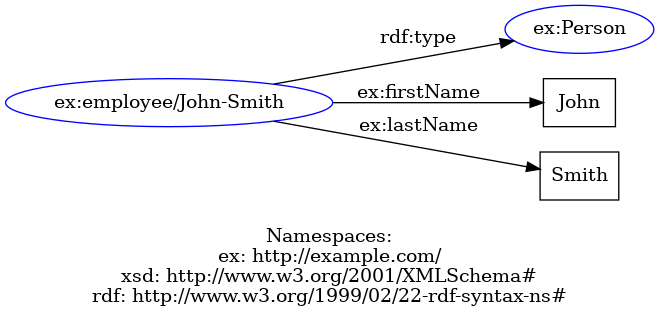
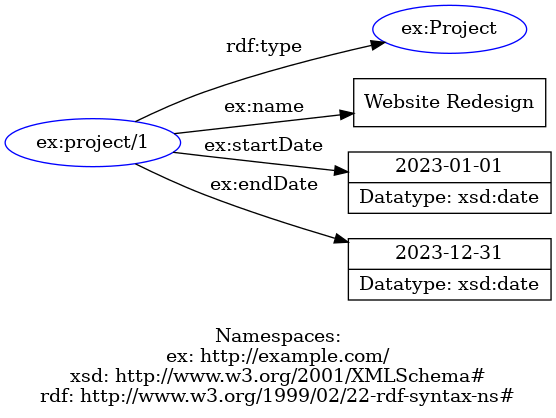
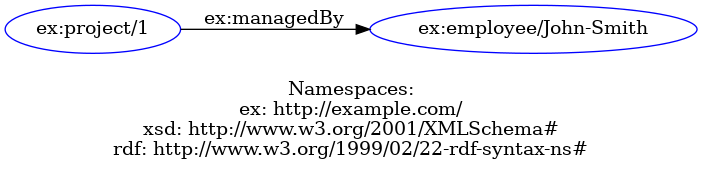
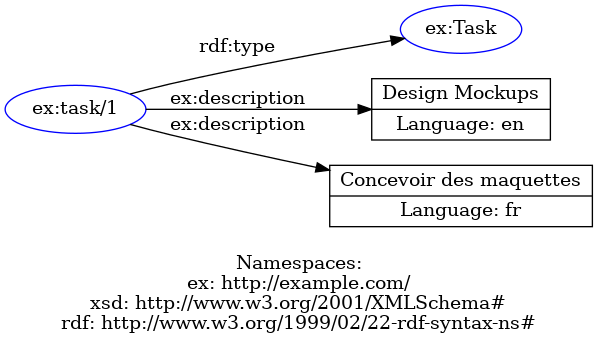
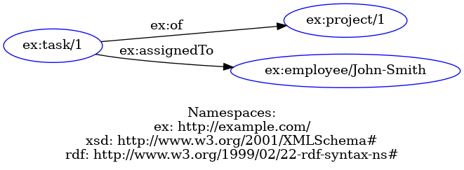

# Tasks
> Describe the data the participant needs to map onto RDF and formulate the tasks accordingly. As we aim to assess the mapping language or tool, participants should be given some indication of the expected output. As such, we avoid participants being misled by the task descriptions.

> The example in this section assumes that participants will have to transform CSV and JSON files into RDF. However, one can easily replace those files with JSON, XML, or a relational database. This [folder](../assets/) contains the files used for this experiment.

You are provided with two CSV files ([employee.csv](../assets/employee.csv) and [project.csv](../assets/project.csv)) and one JSON file ([task.json](../assets/task.json)) containing data about employees, projects, and tasks. 

Your aim is to create mappings that transform this data into RDF triples according to the specifications below. The namespace of the vocabulary that we will use is `http://example.com/`. This namespace is typically assigned to the namespace prefix ns in these tasks.

The following snippet informs the mapping processor which files to transform. You may copy/paste this into the tool or editor.

```ttl
@prefix rdf: <http://www.w3.org/1999/02/22-rdf-syntax-ns#> .
@prefix ex: <http://example.com/> .
@prefix xsd: <http://www.w3.org/2001/XMLSchema#> .
@prefix rml: <http://w3id.org/rml/> .

<#LS1>
    rml:referenceFormulation rml:CSV ;
    rml:source [ a rml:RelativePathSource ; rml:path "employee.csv" ; ]
.

<#LS2>
    rml:referenceFormulation rml:CSV ;
    rml:source [ a rml:RelativePathSource ; rml:path "project.csv" ; ]
.

<#LS3>
    rml:referenceFormulation rml:JSONPath ;
    rml:iterator "$.*" ;
    rml:source [ a rml:RelativePathSource ; rml:path "task.json" ; ] 
.
```

## 1) Generating employees
Create a mapping that generates instances of `ex:Employee`. Employees are identified by an IRI that starts with `http://example.com/employee/` and is followed by their `first_name` and `last_name` with a hyphen (`-`) in the middle. Also, generate the employees' first- and last names using the `ex:firstName` and `ex:lastName` properties. For the first employee, the output should be equivalent to:



## 2) Generating projects
Create a mapping that generates instances of `ex:Project`. Projects are identified by an IRI that starts with `http://example.com/project/` and is followed by their `project_id`. Also, generate the projects' name, start- and end date using the `ex:name`, `ex:startDate`, and `ex:endDate` properties. The start and end dates must be the type `xsd:date`. For the first project, the output should be equivalent to:



## 3) Relating projects to managers
Create or extend the mapping to relate projects to the employees who managed them with the `ex:managedBy` property. Projects have a `manager_id` that refers to the employee that manages the project. For the first project, the triple that is generated should be equivalent to:



## 4) Generating tasks
Create a mapping that generates instances of `ex:Task`. Tasks are identified by an IRI that starts with `http://example.com/task/` and is followed by their `task_id`. Also, generate the tasks' descriptions from `description-en` and `description-fr` and add the appropriate language tags (`en` and `fr`). Use `ex:description` for that property. For the first task, the output should be equivalent to.



## 5) Relating tasks to projects and employees
Create or extend the mapping to relate tasks to the employees assigned to a task with the `ex:assignedTo` property and the project involving this task with the `ex:of` property. Tasks have an `employee_id` and a `project_id` that refer to the employee and project, respectively. For the first task, the triples that are generated should be equivalent to:



## Additional notes
Images were generated with [RDF Grapher](https://www.ldf.fi/service/rdf-grapher).

## License information
<p xmlns:cc="http://creativecommons.org/ns#" xmlns:dct="http://purl.org/dc/terms/"><a property="dct:title" rel="cc:attributionURL" href="https://github.com/chrdebru/kgc-user-study-protocol">The KGC Generation User Protocol</a> by <span property="cc:attributionName">Christophe Debruyne and Ademar Crotti Junior</span> is licensed under <a href="https://creativecommons.org/licenses/by-sa/4.0/?ref=chooser-v1" target="_blank" rel="license noopener noreferrer" style="display:inline-block;">CC BY-SA 4.0 </a></p>